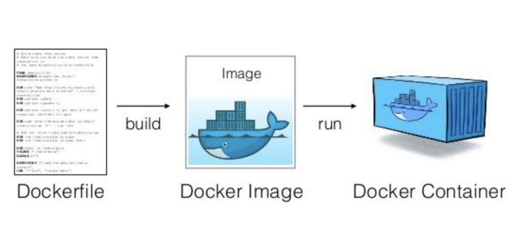
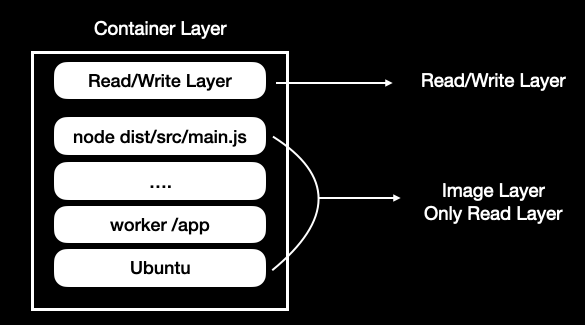

## 도커란?

도커는 격리된 개발, 배포, 실행 환경을 제공하고 관리하는 오픈 플랫폼이다.

## 도커를 사용하는 이유는?

언제 어디서나 도커 엔진위에서 독립되고 동일한 개발 환경 구축을 위해서 사용한다. </br>
도커 활용 예시는 아래와 같다.

1. 어플리케이션에 독립된 실행환경 제공
2. 다중 OS 사용
3. 각 staging별로 동일한 환경 구축

## 도커 사용법



1. Dockerfile을 정의한다. (Dockerfile 정의 예시)
     ```docker
     # FROM: 생성할 도커 이미지의 베이스 이미지를 설정하는 명령어
     FROM node:10
     
     # WORKDIR: 명령어를 실행할 워킹디렉토리를 설정한다.
     WORKDIR /app
     
     # RUN: 도커 이미지를 생성 과정에서 명령어 실행을 위해 사용한다.
     RUN apt-get update
     RUN apt-get install -y vim
     
     # COPY: 호스트 머신에서 도커 컨테이너로 파일을 추가할 떄 사용합니다.
     COPY package*.json ./
     RUN npm install -g pm2
     RUN npm install
     # ENV: 도커 컨테이너의 환경 변수를 추가합니다.
     ENV PATH /app/node_modules/.bin:$PATH
     
     # (앱 소스 추가)
     COPY . . 
     
     # CMD: 도커 이미지가 모두 빌드되고 컨테이너가 실행될때 디폴트로 사용되는 명령어를 설정한다.
     CMD [ "node", "dist/src/main.js" ]
     ```

2. 도커 이미지를 빌드한다.

    ```bash
    docker build --tag getting-started . # 마지막 .은 현재 디렉토리 위치의 Dockerfile을 찾아 실행한다.
    ```

3. Docker cli 명령어로 이미지를 실행해야한다. (Docker CLI로 여러 이미지를 실행 예시)

     ```bash
     # 네트워크 생성 (여러 컨테이너끼리 통신하기위해서는 docker network를 생성해야한다.)
     docker network create todo-app 
     ```

     ```bash
     docker run -d \ # 도커 컨테이너 백그라운드로 실행
          --network todo-app --network-alias mysql \ # 네트워크에 연결
          -v todo-mysql-data:/var/lib/mysql \ # 볼륨 연결 (todo-mysql-data 볼륨은 자동으로 생성되었다.)
          -e MYSQL_ROOT_PASSWORD=secret \ # 컨테이너에 환경 변수 추가
          -e MYSQL_DATABASE=todos \ # 컨테이너에 환경 변수 추가
          mysql:5.7 # 실행할 이미지 입력
     ```

     ```bash
     docker run -dp 3000:3000 \ # 도커 컨테이너 백그라운드로 실행 및 포트 host:container
        -w /app -v "$(pwd):/app" \ # 워킹디렉토리 설정 및 현재 디렉토리에 바인딩 볼륨 설정
        --network todo-app \ # 네트워크에 연결
        -e MYSQL_HOST=mysql \ # 환경 변수 설정
        -e MYSQL_USER=root \
        -e MYSQL_PASSWORD=secret \
        -e MYSQL_DB=todos \
        node:12-alpine \ # 실행할 이미지 입력
        sh -c "yarn install && yarn run dev" # 실행후 실행할 커맨드 입력
     ```


## 도커 컨테이너 구성



도커 컨테이너는 Image Layer + Read/Write Layer로 이루어져있다. </br>
또한 Image Layer 는 Dockerfile에 정의되어있는 명령어들을 통해서 여러 Only Read Layer로 이루어져있다. </br>
(Workdir, Run, Add, Copy 명령어는 레이어로 생성된다) </br>
여기서 Image Layer는 Dockerfile을 통해서만 변경할 수 있고 컨테이너가 실행되면서 기록되는 내용들은 Read/Write Layer에 저장된다. </br>