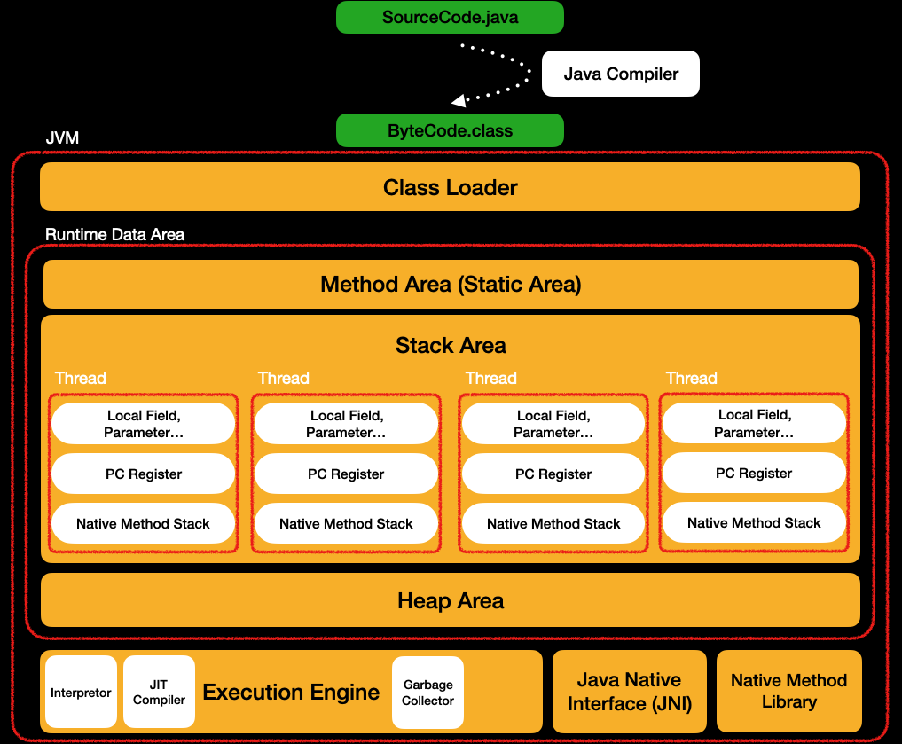

백기선님의 Live-Study의 내용을 진행했다.

# 1주차 목표: 자바 코드는 어떻게 실행되는가? 

  

<i>
개발자가 작성한 자바 프로그램은 JDK안에 있는 Java Compiler를 통해 바이트 코드로 변환되고
JVM이 JRE와 함께 변환된 이 바이트 코드를 실행하면서 자바 프로그램은 실행된다.
</i>

자바 코드를 어떻게 실행되냐고 묻는다면 위처럼 간단하게 말 할 수 있다.
더 나아가 위 한 문장의 내용들을 자세히 살펴본다면 자바 코드가 어떻게 실행되는지 자세히 알 수 있다.

## JDK란? 

JDK(Java Development Kit)란 자바 프로그래밍 언어로 개발하고 실행하기 위한 소프트웨어 개발 도구 모음이다.
이 자바 개발 키트에는 자바를 바이트 코드로 변환하게 해주는 컴파일러, 디버깅 툴, 실행, 문서화 등 다양한 도구와 라이브러리가 포함되어있다.

자바 개발자가 자바 프로그래밍을 하려면 JDK 버전에 맞추어서 설치해야한다.
개념적으로는 JRE나 JVM이 포함되어있지 않아야하지만 배포의 용의성때문에 JDK를 설치하면 JRE나 JVM이 같이 설치된다.

## Java Compiler란? 

자바에서 사용하는 컴파일러는 2가지가 있지만 처음 소개하는 자바 컴파일러는 JDK안에 있는 자바 컴파일러를 말한다.

Java Compiler란 자바로 작성된 프로그램을 바이트 코드로 변환해주는 컴파일러이다. 
자바 프로그램을 컴파일하면 바로 기계어로 변환하거나 실행파일로 변환해주지 않는다. 
따라서 바이트 코드로 프로그램을 실행 할 수 없고 JVM을 통해서 실행 할 수 있다.
이것은 밑에서 좀 더 자세히 설명하겠지만 JVM이라는 가상 머신을 통해서 이식성을 높이기 위해서 이렇게 설계 되었다.

## 바이트 코드란?

바이트 코드(Bytecode)는 0과 1로 구성된 소프트웨어 실행 파일의 중간 형식 중 하나이다.
자바 컴파일러에 의해 생성되며, 기계어보다는 고급 언어에 가까운 형식이다.

바이트 코드는 특정 플랫폼이나 아키텍처에 종속되지 않으며, 가상 머신(Virtual Machine)에서 실행된다.
가상 머신은 특정 플랫폼에 맞는 기계어 코드로 바이트 코드를 변환하고 실행시키는 역할을 한다.
이렇게 하면 동일한 바이트 코드를 실행하는 다양한 플랫폼에서 동일한 실행 결과를 얻을 수 있다.

바이트 코드를 사용하면 전체 컴파일 시간을 단축하고 코드의 이식성(portability)을 높일 수 있다.

## JVM이란? 

JVM(Java Virtual Machine)은 플랫폼, OS, 아키텍처에 독립적으로 Java 프로그램을 실행할 수 있게해주는 구현체이다.

자바를 만든 개발자 제임스 고슬링은 "Write Once, Run Everywhere"라는 슬로건을 걸고 
한번 작성하면 플랫폼, 운영체제, 아키텍처에 상관없이 동작하는 프로그램을 만들고 싶었다.
하여 바이트 코드를 JVM이렇게 함으로써 이식성과 호환성이 높은 프로그래밍 언어를 만들었다.

### 각 구성요소
이제 JVM의 구성 요소를 상세하게 살펴보자.
JVM은 크게 Class Loader, Execution Engin, Runtime Data Area로 나누어져 있다.

### Class Loader

변환된 ByteCode(.class)파일을 JVM이 운영체제로 부터 할당 받은 메모리 영역인 Runtime Data Area로 적재하는 역할을 한다.
클래스 로더는 로딩, 링크, 초기화 과정을 가진다.
여기서 자세한 내용은 다루지 않도록하겠다.

### Execution Engine

실행 엔진 내부적으로는 인터프리터, JIT 컴파일러, 가비지 컬렉션이 있다.

클래스 로더로 Runtime Data Area에 적재된 바이트 코드들은 기계어로 번역되어 실행되어진다.
이때 인터프리터와 JIT 컴파일러를 통해서 기계어로 변역된다.

#### 1. 인터프리터(Interpreter)
바이트코드를 기계어로 번역하는 기본 방식이다. 
인터프리터는 바이트 코드를 명령어 단위로 읽어서 실행한다.
이 방식은 인터프리터로 실행되는 스크립트 언어처럼 느리지만 바이트코드로 어느정도 컴파일 해둔 상태이기때문에
스크립트 언어보다는 빠르지만 인터프리터 방식 자체는 느린편이다. 

#### 2. JIT(Just In Time) 컴파일러
JIT 컴파일러는 실행 시점에 인터프리터 방식으로 기계어 코드를 생성 하면서 그 코드를 캐싱한다. 
기본적으로 사용하는 인터프리터 방식의 문제를 개선하기 위한 컴파일러이다.
이미 번역된 바이트 코드를 실행할때마다 번역해서 동작하는것은 비효율적이고 느리다.
하여 번역된 기계어 코드를 캐시해두었다가 같은 명령어를 실행할때 캐시되어있는 기계어코드를 바로 컴파일 없이 실행하는 방식이다.
하여 인터프리터 방식보다 빠르다.

#### 3. GC(Garbage Collection)
java에서는 더 이상 사용하지 않을 변수, 인스턴스 등을 자동적으로 메모리 해제해주는데 이것을 가비지 컬렉션이 담당한다.
더 이상 사용하지 않을지를 어떻게 판단하는지는 가비지 컬렉션 알고리즘을 참조해야한다. 
여기서는 내용이 너무 많아져서 다루지는 않는다. 

### Runtime Data Area

프로그램이 실행되려면 디스크에 있는 프로그램이 운영체제로 부터 컴퓨터 자원을 할당받아 프로세스가 되어야한다.
이때 디스크에 있는 프로그램 코드들을 운영체제의 코드 영역에 넣고 컴퓨터의 프로세스를 할당받아서 실행영역이 된다.

프로그램을 수행하기 위해 운영체제로부터 할당받은 메모리 공간

#### 1. Method Area(스태딕 영역)

처음 자바 Application이 실행될때 Lang패키지, 클래스, 인터페이스, Static 변수 등을 초기화하는 메모리 공간이다.
이 공간은 자바 Application이 초기화할때 생성되는 공간이며 모든 Static 키워드가 붙은 변수들은 여기에 저장되고 모든 Thread에 공유될 수 있다.

여기에 저장되는 데이터들은 클래스, 인터페이스, 생성자, static 변수, static 메소드, 런타임 상수풀등이 있다.

#### 2. Stack Area(스택 영역)

각 메소드가 시작될때 마다 Stack 영역에 메모리 공간이 stack되어 생긴다.
이 Stack 영역안에서 메소드나 블록이 시작되면 각 영역별로 데이터(매개변수, 지역변수, 리턴, 연산 값, 지역변수)가 임시로 저장되었다가 각 영역이 종료되면 데이터가 소멸된다.
또한 이 영역은 thread별로 각각 독립적으로 생성되고 관리된다. 
하여 Thread 영역에 데이터를 공유하기 위해서는 Method Area영역을 통해야한다.

#### 3. Heap Area(힙 영역)
new 연산자로 생성된 인스턴스와 배열을 저장하고 있다. 

#### 4. PC Register
thread가 시작될 때 생성되는 공간으로 thread마다 하나씩 존재한다.
OS에서 병렬처리가 진행된다면 각 task마다 스케쥴러를 할당받아서 실행될것이다.

#### 5. Native method stack
Java가 아닌 다른 언어로 작성된 코드를 위한 공간이다.
자바 프로그램이 컴파일되어 생성되는 바이트 코드가 아닌 실제 수행할 수 있는 기계어로 작성된 프로그램을 실행 시키는 영역
예를 들어 C++로 작성된 OpenCV같은 네이티브 라이브러리를 사용한다면 여기에 데이터가 저장된다.

## JRE 이란

JRE는 자바 실행환경(Java Runtime Environment)의 약자로서, JVM과 자바 프로그램을 실행(동작)시킬 때 필요한 라이브러리 API를 함께 묶어서 배포되는 패키지 이다. 이외에도 자바 런타임 환경에서 사용하는 프로퍼티 세팅이나 리소스 파일(jar 파일)을 가지고 있다.

### 컴파일하고 실행하는 방법
이제 전체적으로 자바 코드가 어떤 흐름으로 동작하는지 살펴보고 각 구성 요소들이 어떻게 동작하는지 살펴봤으니
실제로 Java Compiler를 통해서 컴파일해보자

1. User.java 파일을 작성한다.
2. javac User.java 라는 명령어를 실행한다.
3. User.class라는 바이트 코드가 생성된다.
4. java User.class 라는 명령어를 이용해서 자바 프로그램을 실행한다.

`java 파일명.class`을하면 JVM이 구동된다.
그러면 JVM은 lang 패키지를 Method Area에 적재하고 실행하는 자바 코드안에서 public static void main이라는 main 메소드를 찾는다.
이 main 메소드를 찾으면 이 main 메소드를 stack 영역에 할당하며 프로그램이 실행된다.